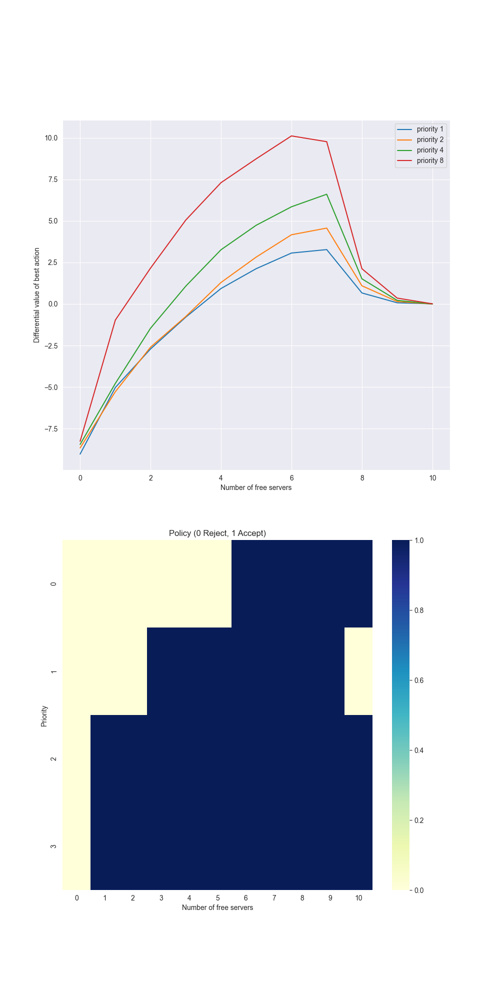

# Access Control — Differential Semi-Gradient Sarsa

This project implements **Differential Semi-Gradient Sarsa** with **Tile Coding** for the **Access-Control Queuing Task** from *Reinforcement Learning: An Introduction* by Sutton & Barto (Example 10.2).

The task involves allocating ten servers to customers of four priority levels, learning an average-reward policy that balances acceptance and rejection decisions.

---

## Project Structure


```
access-control/
│── book_images/ # Reference figures from Sutton & Barto
│ ├── Figure_10_5_1.PNG
│ ├── Figure_10_5_2.PNG
│── generated_images/ # Figures generated by this implementation
│ └── figure_10_5.png
│── notebooks/ # Jupyter notebook with experiments
│ └── access_control.ipynb
│── src/ # Core source code
│ ├── init.py
│ ├── access_control.py
│ └── tile_coding.py
│── README.md # Project documentation
```

---

## Algorithm Overview

The project applies **Differential Semi-Gradient Sarsa** to a continuing control task where rewards are not discounted but averaged over time.  
The agent maintains an estimate of both:

- **Average reward (r̄)** — long-term expected return  
- **Action-value function (Q(s, a))** — approximated with tile coding

Each update follows:

δ = Rₜ − R̄ + Q(Sₜ₊₁, Aₜ₊₁) − Q(Sₜ, Aₜ)  
R̄ ← R̄ + β × δ  
Q(Sₜ, Aₜ) ← Q(Sₜ, Aₜ) + α × δ × ∇Q(Sₜ, Aₜ)

---

## Mathematical Foundation

- **Function Approximation:**  
  Tile coding converts continuous states (free servers, customer priority, action) into binary feature vectors.  
  The value function is represented as a linear combination of active tiles.

- **Semi-Gradient Method:**  
  Only the gradient of the estimated value is used, not of the target.  
  This stabilizes updates while still improving policy performance.

- **Average-Reward Formulation:**  
  Unlike discounted problems, this setup assumes a continuing task, optimizing steady-state performance.

---

## Reference Figures

Textbook comparisons:


---

## Results

Generated output reproduces the expected frequency of free servers and policy patterns:



The learned policy prioritizes high-value customers while maintaining efficient server utilization.

---

## Conclusion

This project demonstrates how **differential methods** and **function approximation** can solve **continuing tasks** without terminal states.  
It reproduces Sutton & Barto’s **Access-Control Queuing Task** and serves as a foundation for extending to **actor–critic** or **other average-reward algorithms**.

---
