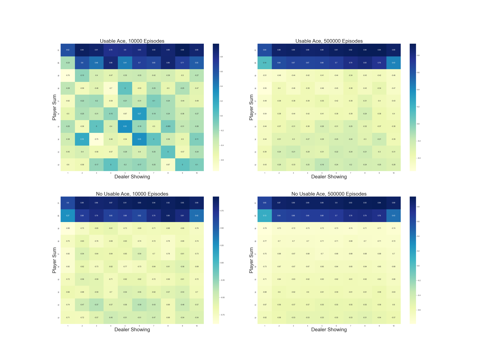

# Monte Carlo in Blackjack

This project implements and compares **On-Policy**, **Exploring Starts**, and **Off-Policy** **Monte Carlo** methods in the classic **Blackjack** environment. 

The goal is to estimate optimal policies and state-value functions by sampling episodes of gameplay without a model of the environment.

---

## Project Structure

```
blackjack/
│── src/ # Core Blackjack logic and learning algorithms
│ └── black_jack.py
│── notebooks/ # Jupyter Notebook with experiments and visualizations
│ └── black_jack.ipynb
│── book_images/ # Reference images from the textbook
│ ├── blackjack-card-values.png
│ ├── Figure_5_1.PNG
│ ├── Figure_5_2.PNG
│ └── Figure_5_3.PNG
│── generated_images/ # Output plots from simulations
│ ├── figure_5_1.png
│ ├── figure_5_2.png
│ └── figure_5_3.png
│── README.md # Project documentation
```
---

## Overview of Algorithms

This project includes implementations of the following Monte Carlo learning strategies:

- **On-Policy Monte Carlo**  
  Estimates the value function under a fixed ε-soft policy by directly averaging returns.

- **Monte Carlo with Exploring Starts (ES)**  
  Ensures that all state-action pairs are visited by initializing episodes from random states and actions. This allows direct policy improvement and leads to optimal behavior.

- **Off-Policy Monte Carlo with Importance Sampling**  
  Evaluates a target policy using data generated from a different behavior policy. Both **ordinary** and **weighted** importance sampling are used to reduce bias and variance.

All approaches use **model-free** learning and rely solely on observed episode outcomes.

---

## Visualizations

### Reference Figures

These figures are reproduced from Sutton & Barto’s textbook and serve as ground truth comparisons:


---

### Simulation Results

Plots generated from the implemented Monte Carlo algorithms:




These visuals show state-value functions and policy evaluations across different Monte Carlo strategies.

---

## Analysis and Interpretation

- **On-Policy Monte Carlo (Fig 5.1)**:  
  Learns the state-value function under a fixed policy (e.g., stick at 20 or 21). States with a usable ace show higher expected returns, particularly against weak dealer cards (2–6).

- **Exploring Starts (Fig 5.2)**:  
  Learns the optimal policy by randomly initializing states and actions. The resulting policy becomes more aggressive in favorable states, adapting to dealer strength.

- **Off-Policy Monte Carlo (Fig 5.3)**:  
  Evaluates the fixed target policy using samples from a random behavior policy. Weighted importance sampling proves more stable than ordinary sampling due to reduced variance.

This project demonstrates how Monte Carlo techniques can converge to optimal behavior without a model of the game.

---

## Conclusion

This implementation highlights the core ideas of **Monte Carlo learning**:

- Policy and value estimation using sampled episodes  
- Trade-offs between exploration, randomness, and convergence  
- Techniques for correcting sampling bias in off-policy settings

Possible extensions include:

- Adding Temporal Difference (TD) methods such as SARSA or Q-Learning  
- Introducing eligibility traces (e.g., MC(λ))  
- Scaling to function approximation or deep RL techniques for continuous action/state spaces

---
