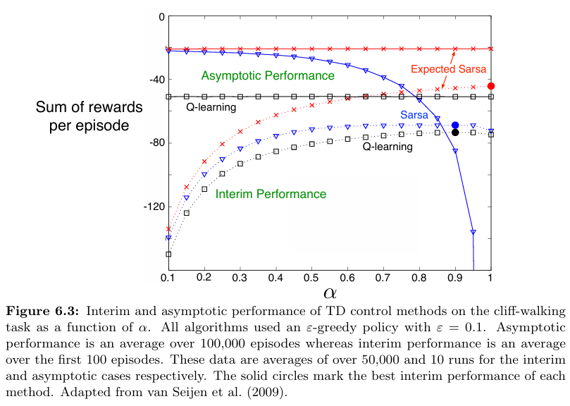

# Temporal-Difference Learning in Cliff Walking

This project implements and compares **SARSA**, **Expected SARSA**, and **Q-Learning** in the classic **Cliff Walking** environment. The implementation is based on **Chapter 6** of _Reinforcement Learning: An Introduction_ by **Richard S. Sutton** and **Andrew G. Barto**.

The goal is to explore how different TD learning methods balance risk, reward, and exploration in an environment with harsh penalties.

---

## Project Structure
```
cliff-walking/
│── src/ # Core logic for environment and learning algorithms
│ └── cliff_walking.py
│── notebooks/ # Jupyter Notebook with experiments and visualizations
│ └── cliff_walking.ipynb
│── book_images/ # Reference images from the textbook
│ ├── Example_6_6_graph.PNG
│ ├── Example_6_6_grid.PNG
│ └── Figure_6_3.PNG
│── generated_images/ # Output plots from simulations
│ ├── example_6_6.png
│ └── figure_6_3.png
│── README.md # Project documentation
```

---

## Overview of Algorithms

This project includes implementations of the following TD control methods:

- **SARSA (State-Action-Reward-State-Action)**  
  An on-policy method that updates using the action actually taken.

- **Expected SARSA**  
  A smoother alternative that uses the expected value over possible next actions, reducing variance.

- **Q-Learning**  
  An off-policy approach that updates toward the maximum possible reward, potentially leading to riskier behavior.

All methods use an **ε-greedy policy** for balancing exploration and exploitation.

---

## Visualizations

### Reference Figures

These figures are taken directly from Sutton & Barto’s textbook and serve as ground truth comparisons:




---

### Simulation Results

Plots generated from the implemented algorithms during training:


These visuals show learned policies and episode returns across SARSA, Q-Learning, and Expected SARSA.

---

## Analysis and Interpretation

- **SARSA** learns a safer policy by avoiding the cliff edge—even if it means a longer path—due to its on-policy nature and reaction to penalties during exploration.

- **Q-Learning**, being off-policy and greedy, learns the shortest path even if it involves falling off the cliff during exploration. It assumes optimal actions regardless of actual exploration outcomes.

- **Expected SARSA** lies between the two: it updates using expected values under the current policy, smoothing learning and often achieving more stable results over time.

This project illustrates the trade-offs between safety and performance under different TD learning strategies.

---

## Conclusion

This implementation showcases core ideas in **Temporal-Difference learning**, emphasizing:

- The difference between **on-policy** and **off-policy** approaches
- The effect of exploration strategies on learned behavior
- The power of sample-based learning without access to a model

It serves as a practical illustration of how reinforcement learning agents adapt to environments with high risk and sparse rewards.

Further extensions could include:
- Testing with different reward structures or grid configurations
- Incorporating eligibility traces (e.g., SARSA(λ))
- Comparing to Monte Carlo or policy gradient methods

---

