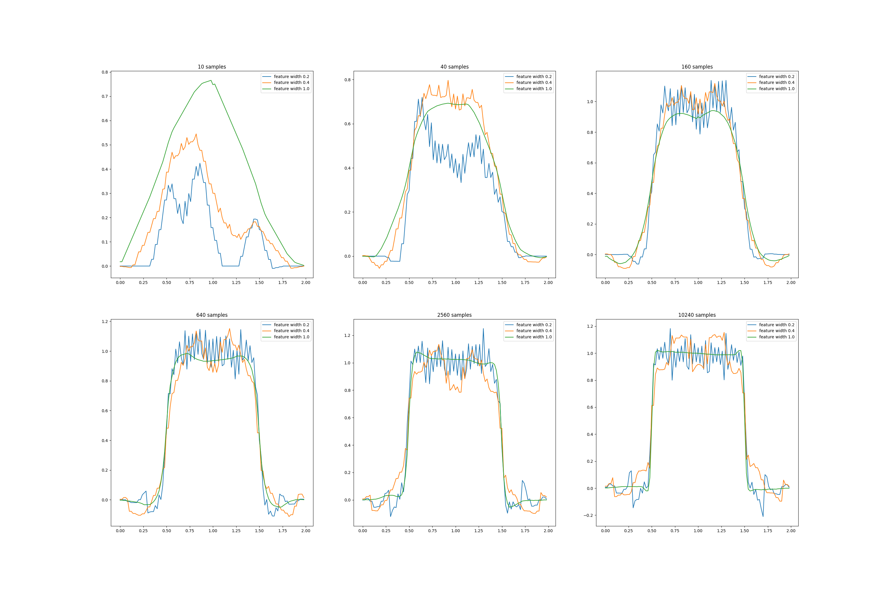

# Square Wave with Coarse Coding

This project explores **coarse coding** for **function approximation** by learning a one-dimensional **square-wave** function using a **linear approximator**.  

---

## Project Structure

```
square-wave/
├── src/ # Feature representation and learning logic
│ ├── classes.py
│ └── square_wave.py
├── notebooks/ # Interactive notebook for experiments
│ └── square_wave.ipynb
├── book_images/ # Reference figure from Sutton & Barto
│ └── Figure_9_8.PNG
├── generated_images/ # Replicated figure from simulations
│ └── figure_9_8.png
└── README.md
```


---

## Overview

- Implements **coarse coding** with overlapping receptive fields
- Tests different **feature widths**: narrow, medium, and broad
- Learns a **1D square-wave target** using gradient descent
- Visualizes trade-offs between **generalization** and **accuracy**

---

## Results

Reproduction of Sutton’s Figure 9.8, showing how feature width affects learning:



---

## Conclusion

Feature width controls the **bias–variance trade-off** in function approximation:

- **Narrow:** precise but poor generalization
- **Broad:** smooth but inaccurate
- **Medium:** best balance between speed and accuracy

This experiment demonstrates how **representation choice** impacts learning performance in reinforcement learning.
