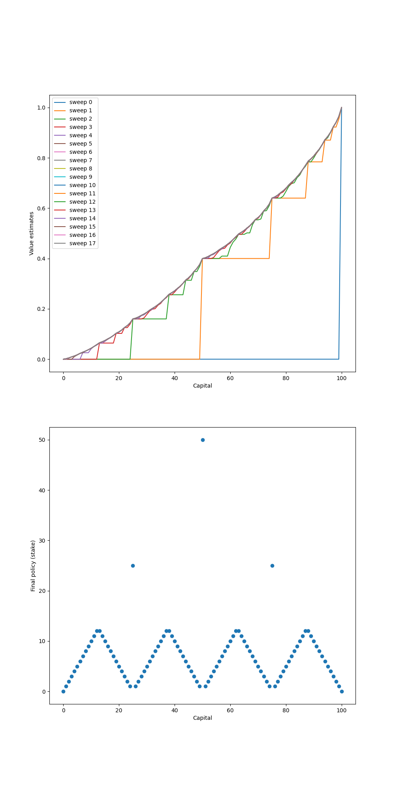

# Gambler’s Problem with Dynamic Programming

This project explores the **Gambler’s Problem** using **Dynamic Programming**, as presented in **Chapter 4** of _Reinforcement Learning: An Introduction_ by **Richard S. Sutton** and **Andrew G. Barto**.

The objective is to find an **optimal policy** for a gambler who bets on the outcome of a coin flip, aiming to reach a goal capital without going bankrupt.

---

## Project Structure
```
gambler-problem/
├── notebooks/ # Interactive notebook to explore the problem
│ └── gambler_problem.ipynb
├── book_images/ # Figures from Sutton & Barto
│ └── Figure_4_3.PNG
├── generated_images/ # Plots generated by this implementation
│ └── figure_4_3.png
└── README.md # Project documentation
```

---

## Environment Description

- The gambler starts with a **capital between 1 and 99**.
- The goal is to reach **100 units of capital**.
- At each step, the gambler can stake an amount between **1 and the minimum of their capital or (100 - current capital)**.
- A biased coin is flipped:
    - If heads, the gambler **wins the stake**.
    - If tails, the gambler **loses the stake**.
- The problem is to find the **policy that maximizes the probability of reaching 100**.

---

## Solution Method: Dynamic Programming

This project applies **Policy Iteration**, a model-based dynamic programming approach, to solve the gambler’s problem.

### Key Techniques:
- **Policy Evaluation:** Iteratively computes the value function under the current policy.
- **Policy Improvement:** Updates the policy greedily based on the value function.

The method repeats these steps until the policy converges to the optimal one.

---

## Visualizations

### Reference Figure from Literature

Figure from Sutton & Barto's book illustrating policy behavior:


---

### Simulation Results

The plot below shows the optimal policy learned by dynamic programming:



This output replicates Figure 4.3 using the implemented solution.

---

## Insights

- The **value function** and **optimal policy** show a non-trivial structure due to the discrete nature of states and actions.
- The **peaks** in the policy correspond to optimal stake sizes, which may appear irregular at first glance.
- This task illustrates the strength of **dynamic programming** in computing exact solutions for small-scale MDPs.

---

## Conclusion

This project demonstrates:

- How **policy iteration** can solve the gambler’s problem.
- The use of **value functions** in decision-making under uncertainty.
- A hands-on application of **model-based reinforcement learning** concepts.

The Gambler’s Problem is a foundational example for understanding **optimal control**, **policy convergence**, and **stochastic dynamics** in reinforcement learning.
