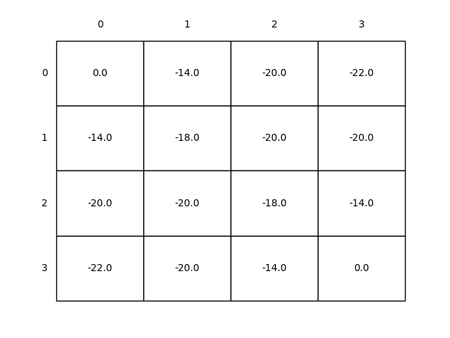

# Gridworld DP

This project explores **Dynamic Programming (DP)** techniques in the classic **Gridworld** environment, inspired by **Chapter 4** of _Reinforcement Learning: An Introduction_ by **Sutton & Barto**.

---

## Project Structure

```
gridworld-dp/
├── src/                          # Core logic and environment
│   └── grid_world.py             # DP algorithms and Gridworld logic
├── notebooks/                    # Interactive notebooks for experiments
│   └── grid_world.ipynb
├── book_images/                  # Original images from the textbook
│   ├── Example_4_1.PNG
│   └── Figure_4_1.PNG
├── generated_images/             # Output visuals from simulations
│   ├── figure_4_1_in_place.png
│   └── figure_4_1_out_place.png
└── README.md                     # Project overview and documentation
```

---

## Key Highlights

-  In-place and out-of-place **policy evaluation** strategies
-  Clear implementation of **policy iteration**
-  Visualization of the **value function** updates
-  Organized structure for experiments and codebase
-  Great for understanding **model-based RL** foundations

---

## Visual Results

### In-Place Policy Evaluation

Each state's value is updated immediately using the most recent estimates.
 
**Result:**


---

### Out-of-Place Policy Evaluation

The value function is updated all at once using a copy of the previous iteration.

 **Result:**



---

## Conclusion

This project helps solidify foundational concepts in **Dynamic Programming for RL**, including:

- Understanding how agents plan using models of the environment
- Differentiating between **asynchronous (in-place)** and **synchronous (out-of-place)** updates
- A strong stepping stone toward more advanced RL methods like **Monte Carlo** and **Temporal-Difference Learning**

---
