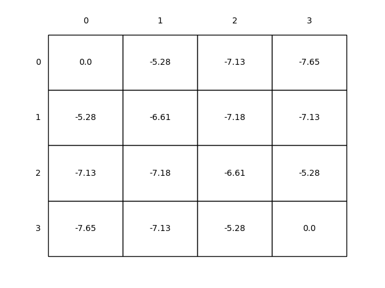
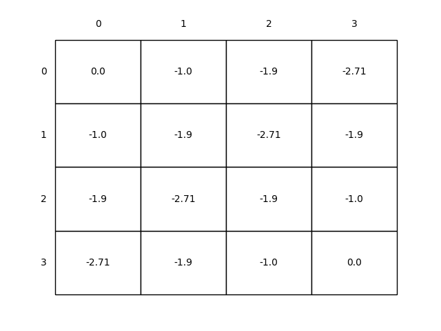
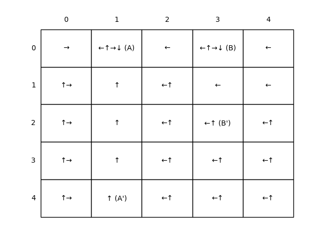

# Gridworld MDP

This project implements the **Gridworld Markov Decision Process (MDP)** — a fundamental environment for understanding **Reinforcement Learning (RL)** concepts. It is based on **Chapter 3** of _Reinforcement Learning: An Introduction_ by **Sutton & Barto**.

---


## Project Structure

```
gridworld-mdp/
├── src/                          # Gridworld logic and MDP implementation
│   └── grid_world.py
├── notebooks/                    # Jupyter Notebooks for experimentation
│   └── grid_world.ipynb
├── book_images/                  # Visual references from the book
│   ├── Figure_3_2.PNG
│   └── Figure_3_5.PNG
├── generated_images/             # Output figures from simulations
│   ├── figure_3_2.png
│   ├── figure_3_5.png
│   └── figure_3_5_policy.png
└── README.md                     # Project documentation
```

---
## Key Features

-  Implements **Gridworld as an MDP** using a clear and modular structure  
-  Explores **state-value functions**, **policy evaluation**, and **policy improvement**  
-  Provides **visualizations** of **value iteration** and **optimal policy**  
-  Supports flexible reward structures and terminal conditions  
-  Interactive **notebooks for step-by-step experimentation**

---

## Visual Results

### State-Value Function Visualization

The **state-value function** defines how beneficial it is for the agent to occupy a specific state, under a given policy.

 **Example Output:**



---

### Optimal Policy via Policy Iteration

**Policy Iteration** is used to derive the optimal policy that maximizes cumulative future rewards.

 **Example Outputs:**





---

## Conclusion

This project builds a foundation in **Markov Decision Processes (MDPs)** within the **Gridworld** setup:

- Understand how **policy evaluation** and **improvement** work
- Learn how **value iteration** leads to optimal behavior
- Develop a strong base for future exploration of **Dynamic Programming** in RL

Ideal for learners seeking hands-on intuition for **model-based reinforcement learning** techniques.

---
