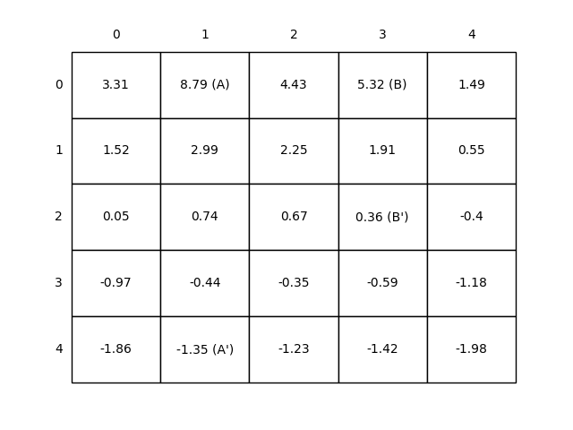

# 🌍 Gridworld MDP

This project implements the **Gridworld Markov Decision Process (MDP)** — a fundamental environment for understanding **Reinforcement Learning (RL)** concepts. It is based on **Chapter 3** of _Reinforcement Learning: An Introduction_ by **Sutton & Barto**.

---

## 📖 References

This project is inspired by:

- **_Reinforcement Learning: An Introduction_**  
  **Richard S. Sutton & Andrew G. Barto**  
  _Second Edition, MIT Press, 2018_  
  [View Book (PDF)](https://www.andrew.cmu.edu/course/10-703/textbook/BartoSutton.pdf)

---

## 📁 Project Structure

```
gridworld-mdp/
│
├── src/                          # Gridworld logic and MDP implementation
│   └── grid_world.py
│
├── notebooks/                    # Jupyter Notebooks for experimentation
│   └── grid_world.ipynb
│
├── book_images/                  # Visual references from the book
│   ├── Figure_3_2.PNG
│   └── Figure_3_5.PNG
│
├── generated_images/             # Output figures from simulations
│   ├── figure_3_2.png
│   ├── figure_3_5.png
│   └── figure_3_5_policy.png
│
├── __init__.py
└── README.md                     # Project documentation
```

---

## 🚀 Getting Started

### 1️⃣ Clone the Repository

```bash
git clone https://github.com/AraratDavtyan/gridworld-mdp.git
cd gridworld-mdp
```

### 2️⃣ Install Dependencies

```bash
pip install -r requirements.txt
```

---

## 📌 Key Features

- ✅ Implements **Gridworld as an MDP** using a clear and modular structure  
- ✅ Explores **state-value functions**, **policy evaluation**, and **policy improvement**  
- ✅ Provides **visualizations** of **value iteration** and **optimal policy**  
- ✅ Supports flexible reward structures and terminal conditions  
- ✅ Interactive **notebooks for step-by-step experimentation**

---

## 📊 Visual Results

### 📌 State-Value Function Visualization

The **state-value function** defines how beneficial it is for the agent to occupy a specific state, under a given policy.

📈 **Example Output:**



---

### 🧭 Optimal Policy via Policy Iteration

**Policy Iteration** is used to derive the optimal policy that maximizes cumulative future rewards.

📈 **Example Outputs:**


---

## 🎯 Conclusion

This project builds a foundation in **Markov Decision Processes (MDPs)** within the **Gridworld** setup:

- Understand how **policy evaluation** and **improvement** work
- Learn how **value iteration** leads to optimal behavior
- Develop a strong base for future exploration of **Dynamic Programming** in RL

Ideal for learners seeking hands-on intuition for **model-based reinforcement learning** techniques.

---
