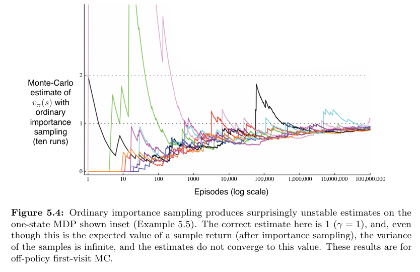
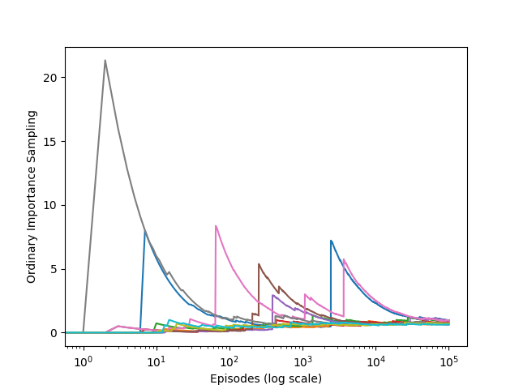

# Monte Carlo Off-Policy Learning: Infinite Variance

This project explores the challenge of **infinite variance** in **off-policy Monte Carlo evaluation** using **importance sampling**. The work is inspired by **Chapter 5** of _Reinforcement Learning: An Introduction_ by **Richard S. Sutton** and **Andrew G. Barto**.

Through simulation, we demonstrate how extreme variance emerges when importance sampling is applied in situations where target and behavior policies diverge significantly.

---

## Project Layout
```
infinite-variance/
│── src/ # Simulation code and environment setup
│ └── infinite_variance.py
│── notebooks/ # Jupyter Notebook for experiments and plotting
│ └── infinite_variance.ipynb
│── book_images/ # Figures from Sutton & Barto
│ ├── Figure_5_4_1.PNG
│ ├── Figure_5_4_2.PNG
│── generated_images/ # Simulation output
│ └── figure_5_4.png
│── README.md # Project documentation
```

---

## Summary of Core Concepts

This project focuses on the instability of **ordinary importance sampling** in off-policy learning scenarios. Specifically:

- **Target policy**: Always takes the `left` action
- **Behavior policy**: Chooses `left` or `right` uniformly at random
- **Reward dynamics**:
    - `right` ends the episode with 0 reward
    - `left` continues with 90% probability or ends with a reward of 1

The probability of an episode exactly following the target policy decreases exponentially with episode length. This causes importance weights to explode for the rare successful episodes, leading to high-variance or even **infinite variance** estimates.

---

## Algorithm Behavior and Setup

The simulation implements the following:

- **Off-policy evaluation** using ordinary importance sampling
- Estimation of expected return under the target policy from episodes generated by the behavior policy
- Recording and visualization of sample estimates across runs

This simple environment starkly illustrates how unstable the learning process becomes when the mismatch between policies grows.

---

## Visual Comparison

### Book Figures 

The following plots are extracted from Sutton & Barto’s textbook and show theoretical results related to variance in off-policy evaluation:




---

### Simulation Output

The result generated by this implementation mirrors the behavior seen in the book:



The plot highlights large fluctuations in estimates over time, even with more episodes.

---

## Key Takeaways

- **Ordinary importance sampling is unbiased**, but can yield extreme or unstable estimates.
- When the target policy is rarely followed under the behavior policy, **importance ratios become extremely large**.
- High variance persists even as the number of samples increases, violating the expectation that more data improves stability.

This validates Sutton & Barto’s point: off-policy methods must be carefully designed, as naive approaches may fail catastrophically in practice.


---

## Conclusion

This project offers a focused demonstration of a fundamental limitation in **off-policy Monte Carlo learning**. While the math may suggest correctness, high or infinite variance can render importance sampling infeasible in practice.

Lessons learned:

- Variance control is just as critical as unbiasedness
- Weighted importance sampling or bootstrapping methods may be necessary
- Simplified environments are useful for exposing core failure modes in reinforcement learning algorithms

This example serves as a cautionary tale and a valuable learning resource for anyone working with model-free, off-policy methods.

---
