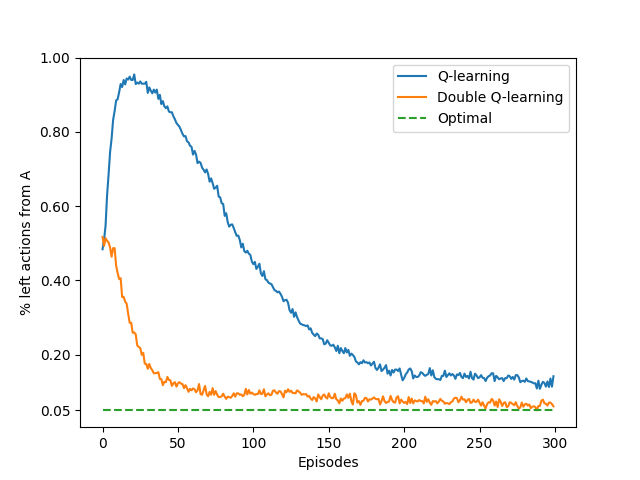

# Reinforcement Learning: Maximization Bias

This project implements Q-learning and Double Q-learning to demonstrate the problem of maximization bias in action-value methods.  
It is based on Chapter 6: Temporal-Difference Learning, specifically Example 6.5, from the book *Reinforcement Learning: An Introduction* by Richard S. Sutton and Andrew G. Barto.

---

## Project Structure

```
maximization-bias/
├── src/                          # Core implementation
│   └── maximization_bias.py      # Logic for Q-learning and Double Q-learning
├── notebooks/                    # Jupyter Notebook for experimentation
│   └── maximization_bias.ipynb
├── book_images/                  # Reference figures from the book
│   ├── Figure_6_5_graph.PNG
│   └── Figure_6_5_mdp.PNG
├── generated_images/             # Plots generated from simulations
│   └── figure_6_5.png
└── README.md                     # Project documentation
```

---

## Key Features

- Implements Q-learning and Double Q-learning.  
- Demonstrates the maximization bias problem in value estimation.  
- Uses a simple two-state MDP to highlight overestimation effects.  
- Tracks the frequency of “left” actions in state A as a performance measure.  
- Reproduces Sutton’s Figure 6.5 experiment.

---

## Environment Overview

The environment is a two-state MDP with the following setup:

- States:
  - A (start state)
  - B (intermediate)
  - terminal (absorbing state)

- Actions:
  - From A: two actions → right (to terminal) or left (to B)
  - From B: ten actions, all equivalent, leading to terminal

- Rewards:
  - From A: always 0
  - From B: reward sampled from Normal(μ = -0.1, σ = 1.0)

---

## Learning Algorithms

### Q-learning

- Standard off-policy action-value learning.  
- Updates based on the maximum estimated value at the next state.  
- Suffers from maximization bias (systematic overestimation).

### Double Q-learning

- Maintains two separate action-value estimates (Q₁, Q₂).  
- At each step, randomly chooses which one to update.  
- Reduces maximization bias by decoupling action selection and evaluation.

---

## Results and Visualizations

### Figures from Sutton's Book

These figures illustrate the expected effect of maximization bias:


---

### Generated Simulation Results



The figure shows how Q-learning consistently favors the “left” action in state A because of maximization bias, while Double Q-learning remains unbiased.

---

## Key Observations

- Q-learning overestimates action values, which leads to a systematic preference for risky choices.  
- Double Q-learning corrects this bias and learns a more stable policy.  
- This experiment highlights why overestimation is problematic in reinforcement learning and how Double Q-learning mitigates it.

---

## Conclusion

This project demonstrates the maximization bias problem in Q-learning and how Double Q-learning addresses it.  
Reproducing Sutton’s Example 6.5 provides insight into why unbiased estimators are essential for stable learning.  
This is an important foundational experiment for understanding limitations of greedy updates in reinforcement learning.
