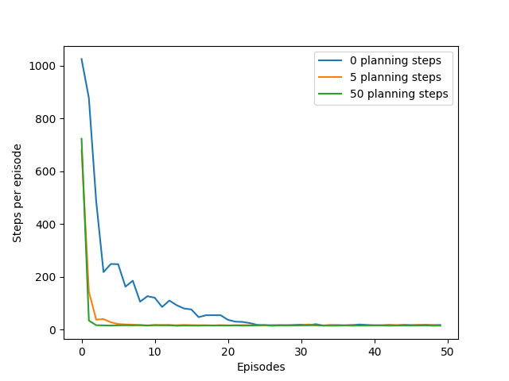

# Reinforcement Learning: Mazes

This project implements and analyzes tabular **model-based reinforcement learning** algorithms, demonstrating the principles from **Chapter 8** of *Reinforcement Learning: An Introduction* by Richard S. Sutton and Andrew G. Barto.  
The core objective is to show how learning from a simulated model of the environment can significantly accelerate learning.

---

## Project Overview

This repository demonstrates the use of **Dyna-Q**, **Dyna-Q+**, and **Prioritized Sweeping** to combine real experience with planning from a learned model.

---

## Key Features Implemented

- Tabular Dyna-Q Algorithm  
- Dyna-Q+ for non-stationary environments  
- Prioritized Sweeping for efficient planning  
- Reproduction of classic maze experiments from Sutton & Barto

---

## File Structure

```
mazes/
├── src/
│   ├── dyna.py
│   ├── functions.py
│   ├── maze.py
│   └── models.py
├── notebooks/
│   ├── changing_maze.ipynb
│   ├── dyna_maze.ipynb
│   └── prioritized_sweeping.ipynb
├── book_images/
├── generated_images/
└── README.md
```

---

## Algorithms Implemented

The following model-based algorithms are implemented. Each combines **direct learning from real experience** with **planning from simulated experience**.

### Tabular Dyna-Q

A foundational architecture that integrates Q-Learning with planning. After each action, it performs:

- **Direct RL Update:** The value function `Q(S,A)` is updated with the real experience `(S, A, R, S′)`.  
- **Model Learning:** The experience is stored in a tabular model.  
- **Planning:** `n` additional updates are performed using experiences randomly sampled from the model.

---

### Dyna-Q+

An extension of Dyna-Q designed for **non-stationary (changing) environments**. It encourages exploration by augmenting the reward function for simulated planning steps.

**Reward Formula:**  
R + κ × √τ


- `κ`: A coefficient controlling the exploration bonus.  
- `τ`: The number of time steps since the state-action pair was last explored in the real world.

This bonus incentivizes the agent to try actions that have not been recently chosen, allowing it to discover changes in the environment.

---

### Prioritized Sweeping

A more efficient planning method than the uniform sampling used in Dyna-Q.  
It prioritizes planning updates based on their potential impact, measured by the magnitude of the TD error.

- A priority queue stores state-action pairs that are likely to have a large value change.  
- This focuses computation on important updates and leads to faster convergence.

---

## Experimental Design

### Environment

- A **6x9 grid world** containing obstacles (a maze).  
- The agent can perform four deterministic actions: **UP**, **DOWN**, **LEFT**, **RIGHT**.  
- A reward of `+1` is given for reaching the goal state; all other actions yield a reward of `0`.

### Scenarios

- **Dyna Maze:**  
  A stationary maze is used to evaluate how the number of planning steps (`n`) in Dyna-Q affects learning speed, comparing `n=0` (pure Q-Learning), `n=5`, and `n=50`.

- **Blocking Maze:**  
  A non-stationary environment where the shortest path is blocked after 1,000 steps. This tests the ability of Dyna-Q+ to adapt compared to standard Dyna-Q.

- **Shortcut Maze:**  
  A non-stationary environment where a shorter path opens after 3,000 steps. This further evaluates the exploration capabilities of Dyna-Q+.

- **Efficiency Comparison:**  
  A stationary maze is used to compare the convergence speed of Prioritized Sweeping against standard Dyna-Q with the same number of updates.

---

## Results and Analysis

The generated results replicate the key findings from the source material.

### Finding: Planning Accelerates Learning

In the Dyna Maze, increasing the number of planning steps (`n`) dramatically reduces the number of episodes required to find the optimal policy.  
The agent with `n=50` learns significantly faster than the agent with `n=5`, which in turn learns faster than the pure Q-Learning agent (`n=0`).

### Book vs. Generated Results (Dyna Maze)

 

---

This structured README provides a clear explanation of the implemented algorithms, environment setup, and experimental results, making it ideal for use on GitHub.
