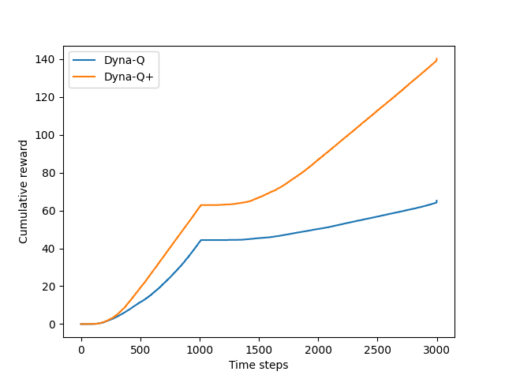
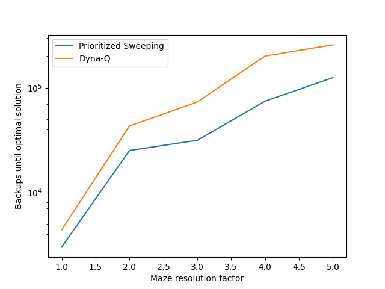

# Mazes: Model-Based Reinforcement Learning

This project implements and compares **Dyna-Q**, **Dyna-Q+**, and **Prioritized Sweeping** — foundational algorithms in **model-based reinforcement learning**.  

---

## Project Structure

```
mazes/
├── src/ # Core implementations
│ ├── dyna.py
│ ├── functions.py
│ ├── maze.py
│ └── models.py
├── notebooks/ # Experiment notebooks
│ ├── dyna_maze.ipynb
│ ├── changing_maze.ipynb
│ └── prioritized_sweeping.ipynb
├── book_images/ # Reference figures from Sutton & Barto
├── generated_images/ # Figures from simulations
└── README.md
```

---

## Overview

- Implements **tabular planning methods** for RL:
    - **Dyna-Q** – integrates model learning and planning
    - **Dyna-Q+** – adds exploration for changing environments
    - **Prioritized Sweeping** – focuses updates on high-impact states
- Simulates multiple maze setups from Sutton & Barto
- Demonstrates how **planning steps** and **exploration bonuses** affect learning performance

---

## Results

Reproduced figures showing learning behavior across Dyna-Q variants:






---

## Conclusion

- **Dyna-Q:** Combines direct RL with planning for faster learning
- **Dyna-Q+:** Adapts to dynamic environments through exploration bonuses
- **Prioritized Sweeping:** Maximizes efficiency by updating important states first

These experiments illustrate how combining **learning from experience** with **model-based planning** accelerates learning and adaptation in reinforcement learning systems.
