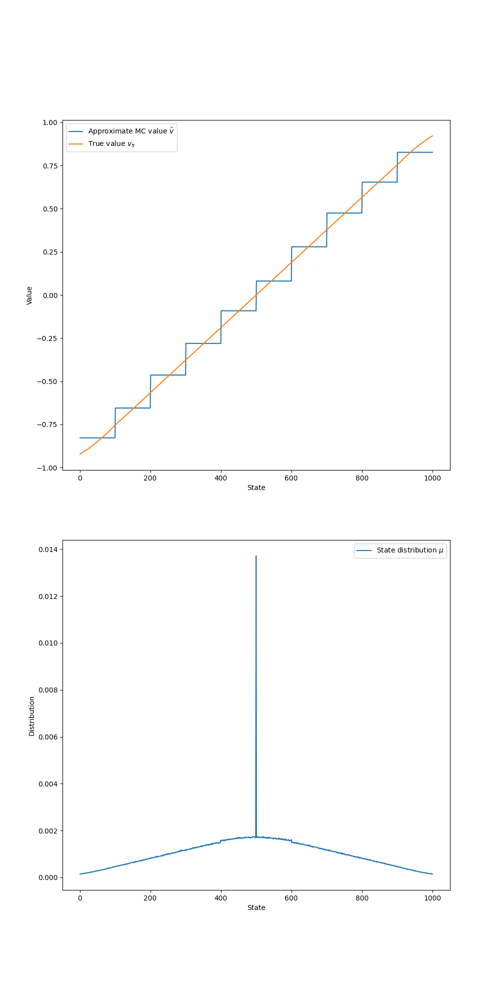
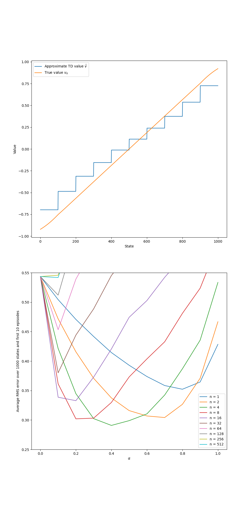
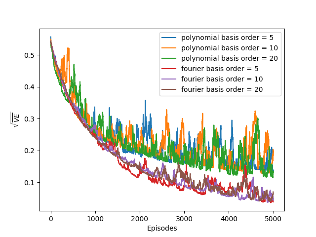
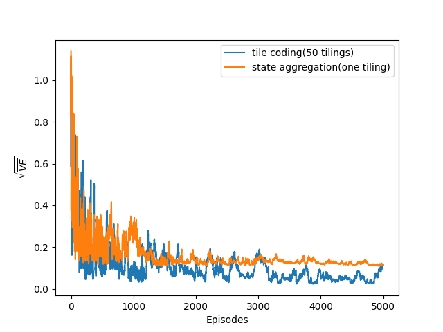

# Random Walk with Function Approximation

This project explores **function approximation** in **Reinforcement Learning** through the **1000-state Random Walk** example from **Chapter 9** of _Reinforcement Learning: An Introduction_ by **Sutton & Barto**.

---

## Project Structure

```
random-walk-fa/
├── src/ # Environment and learning algorithms
│ └── random_walk.py
├── notebooks/ # Experiment notebooks
│ ├── state_aggregation.ipynb
│ ├── bootstrapping.ipynb
│ ├── polynomials_vs_fourier.ipynb
│ └── tile_coding.ipynb
├── book_images/ # Reference figures from Sutton & Barto
├── generated_images/ # Figures from simulations
└── README.md
```
---

## Overview

- Implements a **continuous 1D random walk** with 1000 states
- Uses **Gradient Monte Carlo** and **Semi-gradient TD(0)** for value estimation
- Compares several **function approximators**:
    - State Aggregation
    - Polynomial Basis
    - Fourier Basis
    - Tile Coding
- Evaluates models using **Root Mean Squared Error (RMSE)** against true values

---

## Results

Reproduced and compared key figures from Sutton & Barto:






---

## Conclusion

Different **feature representations** lead to distinct learning behaviors:

- Aggregation is simple but coarse
- Polynomial can diverge
- Fourier gives smoother generalization
- Tile Coding learns efficiently

This project highlights how **feature design** shapes learning stability and accuracy in continuous RL settings.
