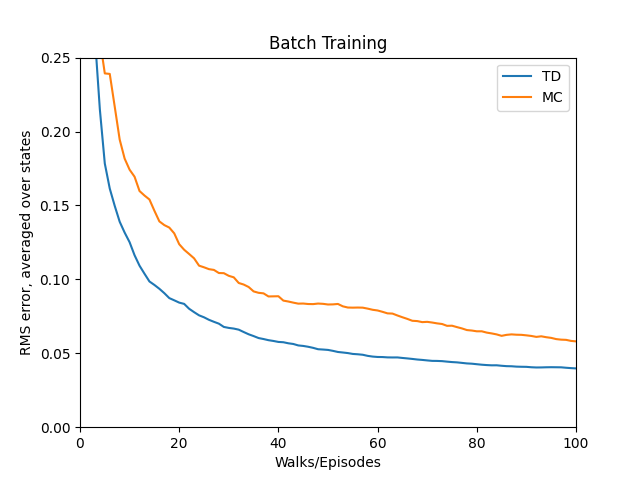
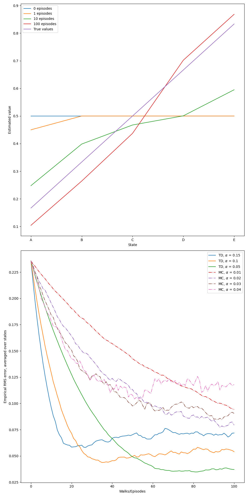

# Temporal-Difference vs Monte Carlo: Random Walk

This project implements **Monte Carlo (MC)** and **Temporal-Difference (TD(0))** learning algorithms to solve the **Random Walk** problem, as described in **Example 6.2** of _Reinforcement Learning: An Introduction_ by **Richard S. Sutton** and **Andrew G. Barto**.

The goal is to understand how both learning methods estimate value functions and behave under identical training conditions.

---

## Project Structure
```
random_walk/
├── src/ # Core logic for Random Walk and learning algorithms
│ └── random_walk.py
├── notebooks/ # Jupyter notebook for running simulations
│ └── random_walk.ipynb
├── book_images/ # Reference figures from Sutton & Barto
│ ├── Example_6_2_top.PNG
│ ├── Example_6_2_bottom.PNG
│ └── Figure_6_2.PNG
├── generated_images/ # Output plots from simulations
│ ├── example_6_2.png
│ └── figure_6_2.png
└── README.md # Project documentation
```

---

## Problem Description

- A **1D grid world** with 7 states:
    - Terminal: State 0 (left), State 6 (right)
    - Non-terminal: States 1–5 (labeled A–E)
- The agent starts in the middle (State 3 / C) and moves randomly left or right with equal probability.
- An episode ends when a terminal state is reached:
    - Left end (State 0) → Reward = 0
    - Right end (State 6) → Reward = 1

**True state values**:
```
V(A)=1/6, V(B)=2/6, V(C)=3/6, V(D)=4/6, V(E)=5/6
```
---

## Learning Methods

### Monte Carlo (MC)
- Updates state values only after an episode ends.
- Uses the full return (final outcome) from each episode.
- Formula:
 ``` V(S) ← V(S) + α * (G - V(S))```
### Temporal-Difference (TD(0))
- Updates estimates during the episode using one-step lookahead.
- Uses bootstrapped value of the next state.
- Formula:
  ```V(S) ← V(S) + α * (R + V(S') - V(S))```

### Batch Learning
- Collects episodes and applies repeated updates until convergence.
- Both MC and TD(0) are evaluated in **batch mode**, revealing how they converge to different solutions even from the same data.

---

## Results and Visualizations

### Book Figures

These are the original visual references from Sutton & Barto’s book:


---

### Simulation Outputs

Results generated by running the project’s learning algorithms:




These plots compare the RMSE of value predictions and how value estimates evolve during training.

---

## Key Insights

- **TD(0)** learns faster due to bootstrapping but may introduce bias.
- **Monte Carlo** gives unbiased estimates with higher variance.
- Under batch training, both algorithms converge to **different solutions**, highlighting the bias-variance trade-off.
- The results align with Sutton’s original Figure 6.2, validating the implementation.

---


## Conclusion

This project offers a hands-on comparison of **Monte Carlo** and **TD(0)** learning in a simple environment:

- Shows how value estimates evolve over time
- Highlights convergence behavior in batch mode
- Reinforces key concepts like bootstrapping and the bias-variance trade-off

The Random Walk task provides an intuitive and powerful introduction to **model-free reinforcement learning** and value prediction.

---
