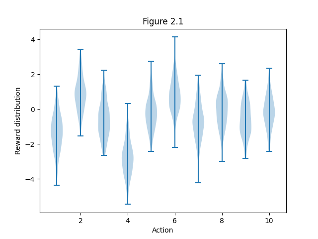
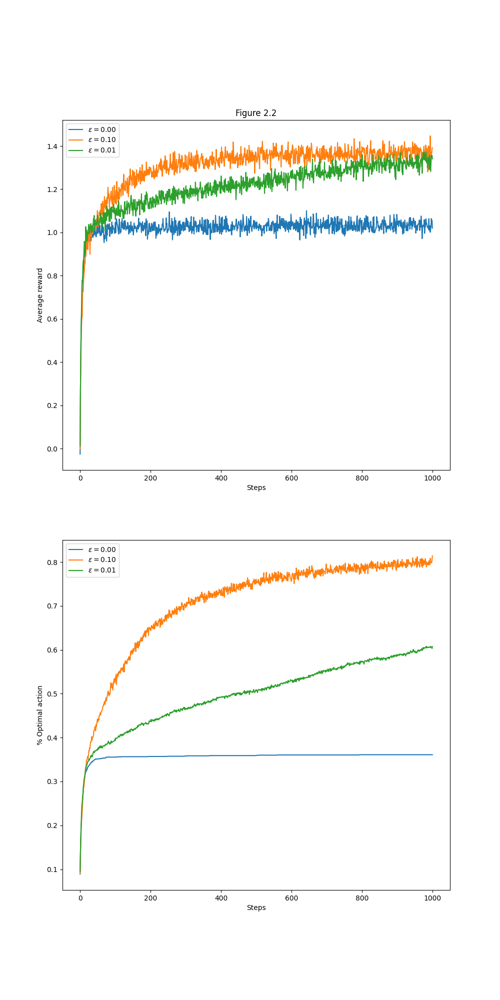
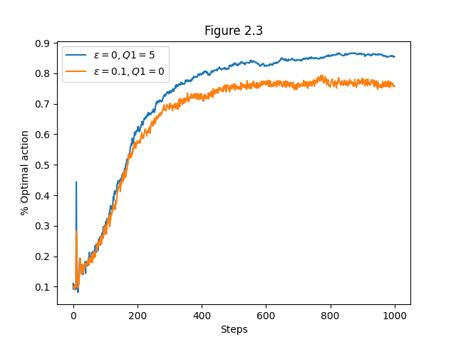

# Action Selection Strategies in the Ten-Armed Testbed

This project implements and compares various **action selection strategies** in the classic **Ten-Armed Testbed** environment. The implementation is based on **Chapter 2** of _Reinforcement Learning: An Introduction_ by **Richard S. Sutton** and **Andrew G. Barto**.

The goal is to evaluate how different strategies perform in identifying optimal actions under uncertainty in a non-trivial yet controlled multi-armed bandit scenario.

---

## Project Structure
```

ten-armed-testbed/
│── src/ # Core logic for bandit environment and algorithms
│ ├── init.py
│ └── bandit.py
│── notebooks/ # Jupyter notebook for experiments and plotting
│ └── ten_armed_testbed.ipynb
│── generated_images/ # Output plots from simulations
│ ├── figure_2_1.png
│ ├── figure_2_2.png
│ └── figure_2_3.png
│── README.md # Project documentation
```


---

## Overview of Strategies

This project implements several foundational action selection strategies for reinforcement learning:

- **ε-greedy**  
  Selects the best-known action most of the time, but explores randomly with probability ε.

- **Optimistic Initial Values**  
  Encourages early exploration by initializing estimates to high values.

- **Upper Confidence Bound (UCB)**  
  Selects actions based on both estimated value and uncertainty, balancing exploration and exploitation effectively.

- **Gradient Bandit Algorithm (GBA)**  
  Uses preferences instead of value estimates and applies a softmax distribution for action selection.

Each strategy supports incremental updates using either **sample averages** or a fixed **step-size parameter**.

---

## Visualizations

### Simulation Results

Plots are generated using repeated experiments to visualize learning dynamics and performance:





- **Figure 2.1**: Compares average reward over time for ε-greedy strategies with different ε values.
- **Figure 2.2**: Shows the effect of **optimistic initial values** on action exploration and convergence.
- **Figure 2.3**: Demonstrates performance of **UCB** and **Gradient Bandit** methods with and without baselines.

These results highlight the strengths and limitations of each strategy in a stationary bandit environment.

---

## Analysis and Insights

- **ε-greedy** finds optimal actions steadily but may converge slowly if ε is too high or too low.
- **Optimistic Initialization** drives exploration early and often leads to faster convergence, especially in greedy settings.
- **UCB** adapts based on confidence and performs robustly even without tuning ε.
- **Gradient Bandit** focuses on maximizing long-term reward by learning action preferences directly, especially effective when combined with baselines.

These strategies form the foundation of decision-making under uncertainty in reinforcement learning.

---

## Conclusion

This project illustrates:

- The mechanics and trade-offs of key action selection strategies
- How exploration influences learning efficiency
- How step-size, optimism, and policy design affect agent performance

It serves as a practical testbed for understanding reinforcement learning behaviors in simplified but realistic environments.

Possible extensions:

- Introduce **non-stationary rewards**
- Explore **Thompson Sampling** or **Bayesian Bandits**
- Add multi-agent competitions or adaptive exploration schedules

---
