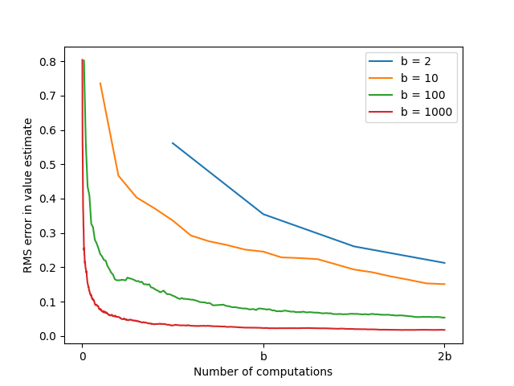

# Updates Comparison

This project compares **expected updates** and **sample updates** in **model-based reinforcement learning**.

---

## Project Structure

```
updates-comparison/
├── src/ # Implementation of expected vs. sample update experiment
│ └── expectation_vs_sample.py
├── notebooks/ # Experiment notebook
│ └── expectation_vs_sample.ipynb
├── book_images/ # Reference figure from Sutton & Barto
│ └── Figure_8_7.PNG
├── generated_images/ # Reproduced figure from simulation
│ └── figure_8_7.png
└── README.md
```


---

## Overview

- Compares **expected** vs. **sample** update methods for planning
- Measures **RMS error reduction** over computation time
- Analyzes effect of **branching factor (b)** on learning efficiency
- Reproduces the analysis and results of Sutton’s Figure 8.7

---

## Results

Reproduction of Sutton’s Figure 8.7 showing RMS error versus computation time for different branching factors:



---

## Conclusion

- **Expected updates:** accurate but computationally expensive
- **Sample updates:** faster, scalable, and more efficient for large state spaces

This experiment demonstrates why **sample-based methods** form the foundation of modern reinforcement learning.
