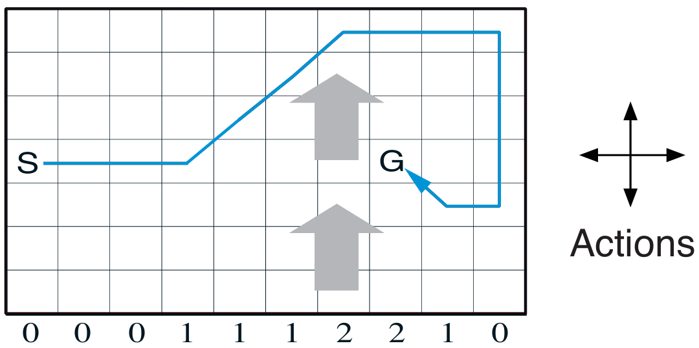
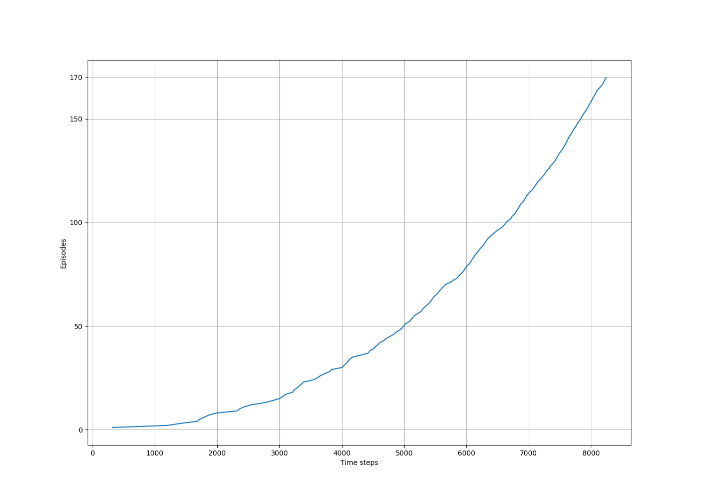

# Windy Gridworld with SARSA

This project implements the **SARSA (State-Action-Reward-State-Action)** algorithm to solve the **Windy Gridworld** task. 

The goal is to apply on-policy Temporal-Difference (TD) learning to a stochastic environment with vertical wind dynamics that affect the agent’s movement.

---

## Project Structure
```
windy-gridworld/
├── src/ # Environment and learning logic
│ └── windy_grid_world.py
├── notebooks/ # Experiment notebook
│ └── windy_grid_world.ipynb
├── book_images/ # Figures from Sutton & Barto
│ ├── Example_6_5_graph.PNG
│ └── Example_6_5_inset.PNG
├── generated_images/ # Output plots from the simulation
│ └── example_6_5.png
└── README.md # Project documentation
```
---

## Environment Description

- A **7×10 grid** where each column has a wind strength that pushes the agent upward.
- The agent starts at position **(3, 0)** and the goal is at **(3, 7)**.
- At every time step, the agent can move **up, down, left, or right**.
- Wind is defined per column:
```[0, 0, 0, 1, 1, 1, 2, 2, 1, 0]```
- Every step results in a **−1 reward**, incentivizing shorter paths to the goal.

---

## Learning Algorithm: SARSA

SARSA is an **on-policy TD control** method that updates the action-value function based on the agent’s actual experience.

### Update Rule (Equation 6.7):
```Q(S, A) ← Q(S, A) + α * [R + γ * Q(S', A') − Q(S, A)]```


### Key Hyperparameters:
- **ε (exploration rate):** 0.1
- **α (step size):** 0.5
- **γ (discount factor):** 1.0

The agent follows an ε-greedy policy, ensuring both learning and sufficient exploration.

---

## Visualizations

### Reference Figures from Literature

Visuals from the book that illustrate the environment and SARSA performance:




---

### Simulation Results

Output generated by running the implemented SARSA algorithm:



This plot tracks the **number of time steps per episode**, indicating how the agent improves over time.

---

## Insights

- The agent becomes increasingly efficient at reaching the goal as learning progresses.
- Wind introduces non-trivial state transitions that the agent must adapt to through trial and error.
- The ε-greedy strategy avoids early convergence to suboptimal paths by enabling continuous exploration.

---


## Conclusion

This project demonstrates:

- How **SARSA** can be used for on-policy control in stochastic environments
- The role of **environmental dynamics** (wind) in shaping optimal strategies
- The practical application of **TD learning** to discrete state-action spaces

Windy Gridworld remains a foundational testbed for exploring exploration, policy evaluation, and control in reinforcement learning.

